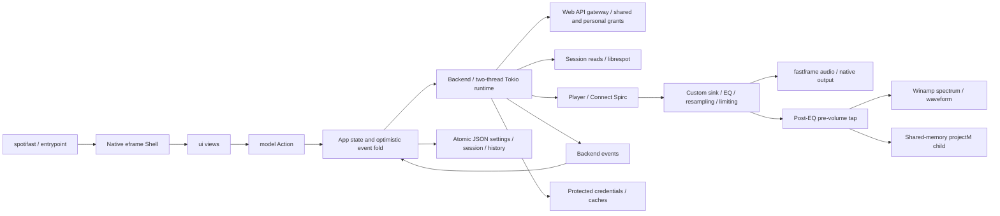

# DaisySpoti Phase 0 review report

Date: 2026-10-07. **Audit delivered; Phase 0 has blocked validation gates.**
No later phase started. Existing failures are preserved, not silently fixed.
The authoritative command/measurement detail is [VALIDATION.md](VALIDATION.md).

## 1. Repository state

Intake was a clean, complete checkout on main, tracking origin/main. Origin is
DaisyCatTs/SpotiDaisy. Upstream was absent, now fetches crmne/spotifast and has an
inert push URL. Work moved safely to dev. Main is unchanged at the baseline.
Dev contains the focused policy/CI commit `a073de4f3e7367c021294c65e0b6293167608613`.
Main and dev reject force/deletion and require linear history, including admins;
main additionally requires review and seven strict status contexts. Fork CI
results and context wiring remain unvalidated. No upstream merge occurred.

## 2. Exact upstream baseline

`995c768dcba4da7f93302bf2107af6b7ec3df02b` is the intake HEAD, origin/main,
fetched upstream/main and merge base. Published recovery tag:
`daisy-baseline/spotifast-995c768`. v0.12.0's tag object is
`f4e3b7c55cd86ba1af292fe077571c572e3f00ba`; its actual release commit is
`ed9cb550d1514b5e7edfcf44d58d04406a3d5c5b`. The checkout contains eleven
post-release upstream commits despite still reporting version 0.12.0.

## 3. Daisy versus upstream divergence

No intake source or commit divergence: 0 ahead, 0 behind, identical tree. The
first Daisy work consists of plan copies, baseline/ADR documents, audit evidence,
safe branch settings, explicit policy override and a dev CI trigger. Cargo,
lockfile, runtime, queue, audio and appearance remain unchanged. Two development
target filenames changed to avoid Windows executable-name elevation heuristics. No new upstream
commit was accepted/rejected or ported. [DIVERGENCE.md](DIVERGENCE.md) separates
inherited behavior from recommended future ownership.

## 4. Architecture map

334 tracked files and 102,926 Rust lines were inventoried after the policy
commit. App is the principal sequencing/state owner; backend owns requests,
auth workers, caching and engine lifecycle. `api/*`, `session_reads`, `player`,
`sink`, `eq`, `limiter`, `resample`, `vis`, `milkdrop/*`, `skin/*`, `winamp`,
platform modules and `ui/*` are mapped in [ARCHITECTURE.md](ARCHITECTURE.md).

## 5. Current feature inventory

Native modern shell; Home, search, library shelves, Liked Songs, recent/local
history, playlist/album/artist/show/radio pages; podcasts; playlist CRUD, ordering,
multi-selection and cover uploads; local Spotify playback and remote Connect;
devices and receiver activation; queue, shuffle/repeat/seek/volume; lyrics and
LRCLIB fallback; ten-band EQ, normalization and limiter; Winamp skins/playlist/EQ;
MilkDrop presets and native child; spectrum/waveform; themes, localization,
keyboard shortcuts, CLI control, tray, native media integration and updater.
Audio/art/lyrics/playlists/liked metadata caches and protected grants exist.

Pure Shuffle, local file playback, Daisy DB, source linking, new UI, Daisy Sound,
exclusive/bit-perfect audio and Spotify lossless are not implemented by this
audit. Preserve the existing queue's duplicate occurrences, optimistic updates,
local-only clear/reorder and stale-answer protection.

## 6. Dependencies and platforms

Rust 1.98.0, edition 2024. egui/eframe 0.36.1 via crmne fork, winit 0.30 fork,
fastframe v0.4.1, librespot 0.8 patched fork, rodio mixer/custom sink, cpal output,
reqwest/rustls, Tokio, native keyrings, projectM static default MilkDrop.
Exact commit pins and full direct/duplicate trees are in the dependency audit.
No new application crate or version change.

Windows: Credential Manager, native output/media/tray/thumbbar/URL handler.
macOS: Keychain, media/menu/Dock/URL/notch/Touch Bar guard and bundle updates.
Linux: Secret Service, MPRIS, PulseAudio/PipeWire-compatible output, Wayland/X11,
tray/portals and Flatpak. Windows x64 ran; WSL packaging/docs ran. The other
native targets were inspected, not built or tested.

## 7. Tests/build results

Formatting, both clippy variants, rustdoc, doc-test command, development demo,
optimized demo, production release, native keyring dummy round trip and Jekyll pass. Library tests:
939 default / 962 all-feature pass, one ignored native test later run and passed.
Other executed bin/branding/localization tests pass. Initial complete Cargo test
commands exited 101 with Windows error 740. Follow-up neutral target filenames
allow the unchanged tests to run; both final complete Cargo commands now pass. All-feature clippy and formatting
pass too; outcomes are in VALIDATION.md.
Metainfo and release-name Python checks each pass four tests. Launcher checks
pass all four tests in a clean LF export. The earlier Flatpak mismatch finding
was caused by CRLF in the desktop payload and is superseded.
Dependency advisory scan fails. Full evidence and platform limits are explicit.

## 8. Performance baseline

Installed 0.12.0 user-confirmed playback, 120 seconds: mean total-machine CPU
0.24556%, resident RAM 244.789-249.625 MiB, private commit 379.676-385.582 MiB.
Paused, 120 seconds: mean CPU 0.01871%, resident RAM 241.188-244.910 MiB,
private commit 377.391-378.254 MiB. Its binary hash matches the
published upstream v0.12.0 Windows portable payload, associated with the release
tag eleven commits before our checkout. This is artifact identity, not signed
source-build provenance. No login/settings were modified or grants exported.

Optimized isolated demo startup and ten-minute paused/static memory samples are
in performance.json/startup.csv/idle-soak.csv: fresh-profile window readiness
157.33 ms, warm 36.00-47.66 ms, mean CPU 0.01676%, working set
179.043-200.164 MiB, private commit 293.648 to 288.570 MiB.
Fresh profile is not reboot-cold,
native handle readiness is not first paint, and demo does not decode Spotify
audio. True cold and multi-hour/day sessions remain unvalidated.

## 9. Bugs, warnings and risks

Inherited updater target names triggered UAC launch failure, now corrected; Windows
CRLF obstructs Unix script tests; missing native tooling at intake; crowded and
clipped 760px queue layout; initially unregistered fork CI, now activated; four dependency vulnerabilities
and one unmaintained transitive dependency. Updater/package identities still
target Spotifast. No claimed fix, suppression or clean security bill.

## 10. Technical debt

Large App/Backend convergence points; duplicated rich track metadata and
long-lived page/cache collections need bounded-cache profiling; cross-cutting
queue/auth generation logic; coordinated supplier forks; dynamic platform/font
and rendering costs; stale packaging docs; no repository license/advisory policy.
These are audit findings or candidates, not measured proof of a leak or automatic
authorization to rewrite. The observed short samples cannot prove memory bounds.

## 11. Security/privacy/licensing

Positive evidence: PKCE/loopback OAuth, redacted response errors, OS-protected
grants/proxy passwords, generation guards, migration readback and atomic JSON.
No telemetry SDK/browser engine found. Spotify/API, LRCLIB, GitHub updates/presets,
LAN discovery and demo Picsum traffic are documented. App-side update publisher
signature enforcement is not configured, despite checksum verification.

Retain Spotifast/librespot MIT notices, icon ISC/MIT notices and font licenses.
projectm-sys declares LGPL-3.0-or-later while bundled native license texts include
LGPL 2.1; static distribution/source/relinking and preset/asset notices require
review before release. Audit completed, distribution compliance not certified.

## 12. Upstream integration risks

Blind merges would collide with future Daisy UI/model/settings/queue ownership;
partial egui/winit/fastframe/librespot updates can break hidden-window pacing,
bidi/emoji/accessibility, queue controls, auth/recovery or audio taps. Identity
changes affect credentials, files, single-instance IPC, updater and OS packages.
Upstream branding/release automation can overwrite or publish the wrong product.
The accepted/rejected ledgers intentionally contain no invented commit decisions.

## 13. Recommended refactor boundaries

First preserve behavior with tests, then introduce narrow seams: product/UI state
versus Spotify transport, request routing/capability reporting, queue domain and
occurrence identity, persistence/migrations, native output versus processing/tap,
Winamp/MilkDrop lifecycle and platform adapters. Extract one responsibility at a
time, benchmark sensitive paths, maintain supplier patch logs. No speculative
provider/audio/plugin/database abstraction was implemented or prematurely decided.

## 14. Files created or modified

Copied master plan/handoff/Figma brief. Added the four required upstream files,
architecture/security/quality/validation/report companions, screenshot index,
two measurement scripts and sanitized evidence/captures. Added ADR index and
three ADRs (upstream strategy, preserved native subsystems, credentials/identity).
Renamed the integration test and developer inspection example without changing
their contents. Updated only Phase 0-related master checklist entries. Added Daisy overrides to
AGENTS/CONTRIBUTING and dev to the CI push trigger. Git refs/remotes and host
protections changed; runtime source and application dependencies did not.

## 15. Checklist status

The master plan is authoritative. Inventory, exact SHA, remotes, protected branch
structure/dev, upstream documents, screenshots, dependency/architecture/license
audits and branding plan are validated audit deliverables. Complete cold/exact-build performance coverage and fork CI remain blocked.
Completed Phase 0 rows: inventory fork; upstream SHA; remotes; branch protection;
dev; upstream docs; baseline tests; screenshots; dependencies; architecture; licensing audit;
branding replacement plan. Completed Task A rows: root; branch/remotes; exact
relationship; architecture; features; existing Daisy changes; tests; demo; screenshots;
upstream docs; ADRs. All six Task B rows completed.
Task A/B rows distinguish executed successes from blocked validation. No Phase 1
or later feature checklist was advanced.

## 16. Blocked/unresolved

Native matrix/Nix completion; real cold startup and exact-build authenticated
performance; multi-hour/day browsing/audio soak; legal/package attribution
compliance and upstream advisory remediation. The last two were audited but are
release risks, not scope for a broad Phase 0 dependency/audio rewrite.

## 17. Exact starting point for Phase 1

First review this audit and decide how to close the remaining Phase 0 gates.
After authorization to Phase 1, begin with Figma foundations and a matched
prototype for the existing shell: neutral tokens, typography, dark/light/OLED,
density and narrow/normal window behavior. Preserve Action/backend boundaries
and Winamp/MilkDrop; approve visual scope before runtime shell implementation.
Use the clipping capture as a real constraint. Do not start Pure Shuffle, local
music, provider/audio expansion or Daisy Sound automatically.

Closeout follow-up: audit/test fixes are pushed to dev, the fast Daisy baseline
workflow passed, and the full CI matrix is active. See CLOSEOUT.md for the exact
run and security/licensing priorities. Stable main and supplier dependency pins
remain unchanged.
